#（三）RocketMQ集群部署实践
>全篇参照--《MyRocketMQ集群部署实战-双master-双slave-同步双写-异步刷盘（7台机器） - tantexian的博客空间 - 开源中国社区》
>
>原文地址：https://my.oschina.net/tantexian/blog/703784
>
>本文是笔者在参考上文实践过程中的理解和扩充
>
>符号“【】”中内容、附注5，6以及FAQ中内容均笔者所注
>
>作者：Nick


##一、基础环境配置：

以下所有机器均为16G内存。【内存配置可修改，128M以上，笔者测试机器内存平均为4G】

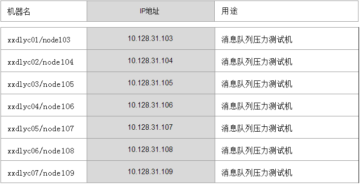


##二、集群部署图

__（四NameServer、双Mastere双Slave、同步双写、异步刷盘）：__

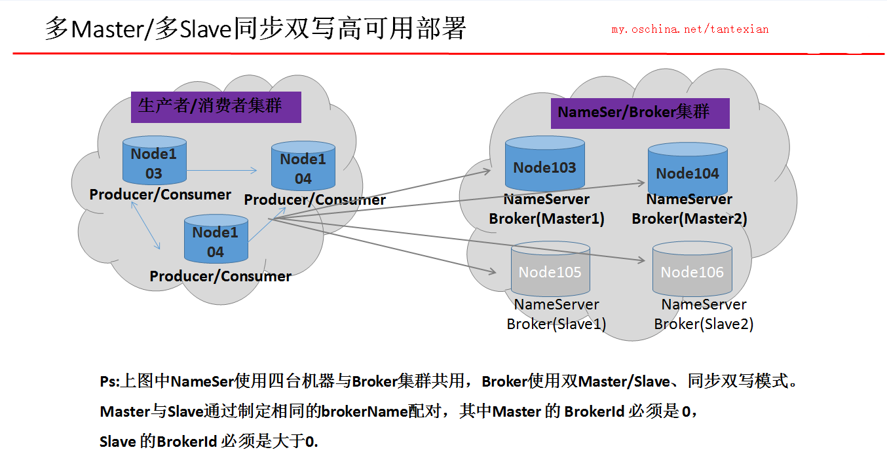

##三、对centos7操作系统参数调优：
【该步骤未进行，为生产环境下的优化操作，官网写到该步骤一个系统只可优化一次】

执行下述shell脚本：

```
#!/bin/sh

# Execute Only Once

#当前程序运行环境用户名
USERNAME=root
#需要修改IO模式磁盘盘符
DISKNAME=sda

echo 'vm.overcommit_memory=1' >> /etc/sysctl.conf
echo 'vm.min_free_kbytes=5000000' >> /etc/sysctl.conf
echo 'vm.drop_caches=1' >> /etc/sysctl.conf
echo 'vm.zone_reclaim_mode=0' >> /etc/sysctl.conf
echo 'vm.max_map_count=655360' >> /etc/sysctl.conf
echo 'vm.dirty_background_ratio=50' >> /etc/sysctl.conf
echo 'vm.dirty_ratio=50' >> /etc/sysctl.conf
echo 'vm.page-cluster=3' >> /etc/sysctl.conf
echo 'vm.dirty_writeback_centisecs=360000' >> /etc/sysctl.conf
echo 'vm.swappiness=10' >> /etc/sysctl.conf
cat /etc/sysctl.conf
sysctl -p

echo 'ulimit -n 655350' >> /etc/profile
echo "$USERNAME hard nofile 655350" >> /etc/security/limits.conf

#DISK=`df -k | sort -n -r -k 2 | awk -F/ 'NR==1 {gsub(/[0-9].*/,"",$3); print $3}'`
#[ "$DISK" = 'cciss' ] && DISK='cciss!c0d0'
echo 'deadline' > /sys/block/$DISKNAME/queue/scheduler


echo "---------------------------------------------------------------"
sysctl vm.overcommit_memory
sysctl vm.min_free_kbytes
sysctl vm.drop_caches
sysctl vm.zone_reclaim_mode
sysctl vm.max_map_count
sysctl vm.dirty_background_ratio
sysctl vm.dirty_ratio
sysctl vm.page-cluster
sysctl vm.dirty_writeback_centisecs
sysctl vm.swappiness

su - $USERNAME -c 'ulimit -n'
cat /sys/block/$DISKNAME/queue/scheduler
```


##四、下载源码及编译（maven、git）：

### 1、安装maven、git：

```
yum install -y maven git
```

### 2、下载源码：

```
git clone https://git.oschina.net/tantexian/MyRocketMQ.git
```

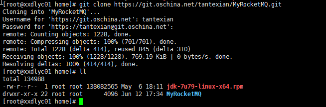
【先在一个机子上安装git、maven来编译源码，jdk需要安装在7台机子上，上一篇文章有安装的解疑】

### 3、编译源码：

```
cd MyRocketMQ/
sh install.sh
```

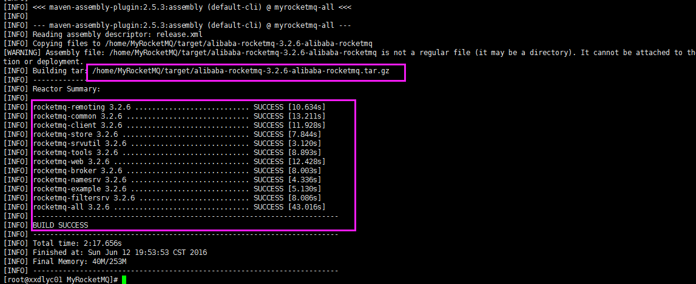

### 4、将编译后的代码放置到自定义文件目录

__（本次实验中放置到/home目录：）__

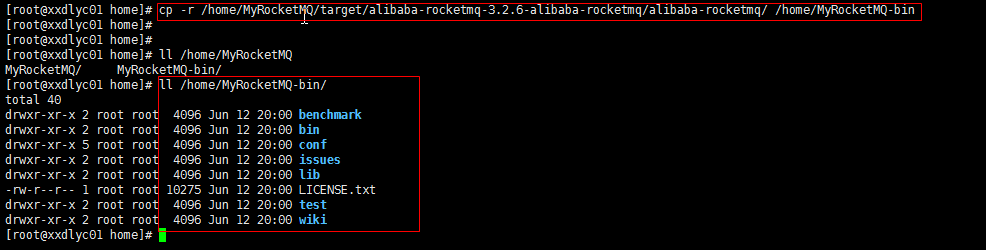

PS：此处需要将编译后的MyRocketMQ-bin文件分别scp或者rsync同步到其他所有机器上去：
```
rsync -avzP /home/MyRocketMQ-bin/ root@10.128.31.104:/home/MyRocketMQ-bin/
rsync -avzP /home/MyRocketMQ-bin/ root@10.128.31.105:/home/MyRocketMQ-bin/
rsync -avzP /home/MyRocketMQ-bin/ root@10.128.31.106:/home/MyRocketMQ-bin/
rsync -avzP /home/MyRocketMQ-bin/ root@10.128.31.107:/home/MyRocketMQ-bin/
rsync -avzP /home/MyRocketMQ-bin/ root@10.128.31.108:/home/MyRocketMQ-bin/
rsync -avzP /home/MyRocketMQ-bin/ root@10.128.31.109:/home/MyRocketMQ-bin/
```
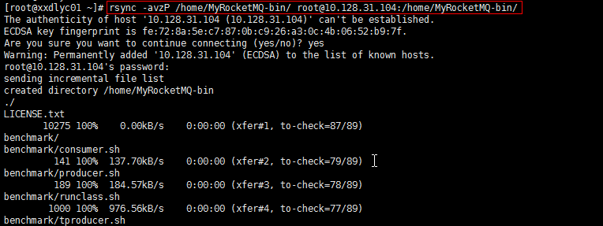

### 5、若不希望每次rsync输入密码验证，可以配置互信ssh、scp、rsync登录传输（互通）：

```
1、在主节点node103上生成秘钥（输入命令后一直回车即可）：
ssh-keygen -t rsa       
2、分别将node103加入到node104、node105、node106、node107、node108、node109的authorized_keys中
rsync -avzP /root/.ssh/id_rsa.pub root@10.128.31.104:/root/.ssh/authorized_keys
rsync -avzP /root/.ssh/id_rsa.pub root@10.128.31.105:/root/.ssh/authorized_keys
rsync -avzP /root/.ssh/id_rsa.pub root@10.128.31.106:/root/.ssh/authorized_keys
rsync -avzP /root/.ssh/id_rsa.pub root@10.128.31.107:/root/.ssh/authorized_keys
rsync -avzP /root/.ssh/id_rsa.pub root@10.128.31.108:/root/.ssh/authorized_keys
rsync -avzP /root/.ssh/id_rsa.pub root@10.128.31.109:/root/.ssh/authorized_key

注：这样以后从node103往其他节点copy东西则不再需要输入密码验证！！！
```

最好检测其他所有node是否同步成功MyRocketMQ-bin：

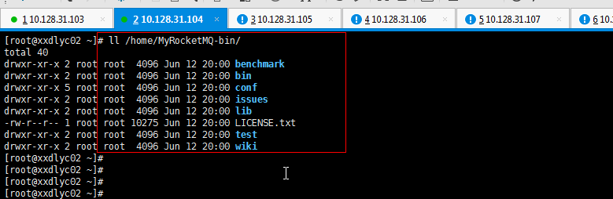

【rsync比scp传文件要慢一些】


##五、配置JDK、Rocketmq等环境参数：

### 1、安装jdk(依次在所有机器配置执行)：

```
虽然目前google已经尝试使用openjdk代替oraclejdk：http://www.oschina.net/translate/openjdk-is-now-the-time）
还是建议使用oracle的jdk替换掉自带的openjdk，若不想替换则无需下续步骤。
首先卸载自带的openjdk：
```
【注：经测试openjdk也可使用，只要保证唯一jdk就行，否则会冲突】
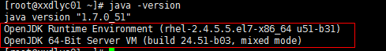

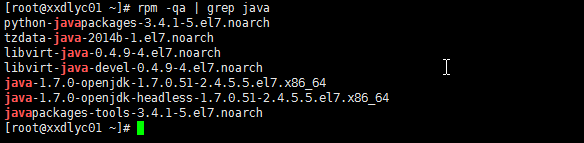

```
rpm -e --nodeps java-1.7.0-openjdk-1.7.el7.x86_64 java-1.7.0-openjdk-headless-1.7.0.51-2.4.5.5.el7.x86_64
```

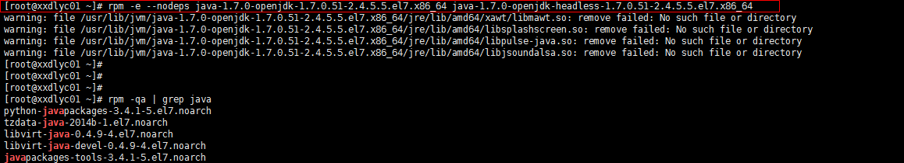

>ps：如果rpm -e 下载不成功，可以尝试使用yum remove命令卸载。
>然后再去oracle网站下载对应的jdk安装：
>若下载的为rpm包：则使用rpm -ivh xxx 进行安装即可！！！


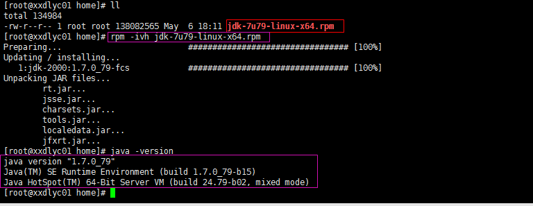


### 2、配置jdk和Rocketmq环境变量：

```
vim /root/.bashrc  #在该文件添加一下内容

# Set RocketMQ Environment
ROCKETMQ_HOME=/home/MyRocketMQ-bin # 此处为上述步骤中的maven编译后文件目录代码
ROCKETMQ_CLASSPATH=$ROCKETMQ_HOME/lib  # 此处为rocketmq运行所依赖的jar的classpath
ROCKETMQ_PATH=$ROCKETMQ_HOME/bin  # 此处为rocketmq运行bin目录，加入到可执行命令
export ROCKETMQ_HOME  ROCKETMQ_CLASSPATH ROCKETMQ_PATH  # 设置环境变量
# 此处根据具体nameser集群设置环境变量
export NAMESRV_ADDR='10.128.31.103:9876;10.128.31.104:9876;10.128.31.105:9876;10.128.31.106:9876'  

# Set Java Environment
JAVA_HOME=/usr/java/jdk1.7.0_79
JRE_HOME=/usr/java/jdk1.7.0_79/jre
PATH=.:$PATH:$JAVA_HOME/bin:$JRE_HOME/bin:$ROCKETMQ_PATH  # 此处将ROCKETMQ_PATH
CLASSPATH=.:$CLASSPATH:$JAVA_HOME/lib/dt.jar:$JAVA_HOME/lib/tools.jar:$JRE_HOME/lib:$ROCKETMQ_PATH
export JAVA_HOME JRE_HOME PATH CLASSPATH
```

* PS：编辑完成执行 source/root/.bashrc或者 . /root/.bashrc 使之生效
* 执行：chmod +x /home/MyRocketMQ-bin/bin/ *
* 上述命令将/home/MyRocketMQ-bin/bin/目录下的命令加入到PATH，即linux能直接执行。
* 注意：同理需要将/root/.bashrc文件使用rsync或者scp同步到其他所有节点上去！！！

【采用集群模式时，启动broker时，需要指定nameserver 地址集，即`NAMESRV_ADDR`，包含每一个nameserver集群地址。因为nameserver之间不会进行信息同步，均通过broker定时汇报保持各节点信息“同步”】


##六、集群启动：


###1、将所有hostname配置到hosts:

```
vim /etc/hosts
```


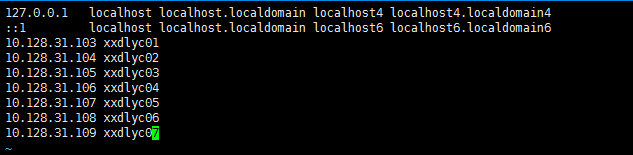


__同步到所有机器！！！__


```
先附上集群部署规划(更多详细请自行参考前续集群部署图)：
NameServer集群：node103/node104/node105/node106
Master1/Slave1 :  node103->node105
Master2/Slave2 :  node104->node106
Producer/Consumer集群：node107/node108/node109
```


###2、先启动NameServer集群节点
__（node103/node104/node105/node106分别执行以下命令）：__

```
nohup sh /home/MyRocketMQ-bin/bin/mqnamesrv &
```

###3、再启动Broker服务
__【双主双备，修改相应的配置文件参数】__

```
node103：
cp /home/MyRocketMQ-bin/conf/2m-2s-sync/broker-a.properties /home/MyRocketMQ-bin/conf/2m-2s-sync/broker-master1.properties
vim /home/MyRocketMQ-bin/conf/2m-2s-sync/broker-master1.properties
```


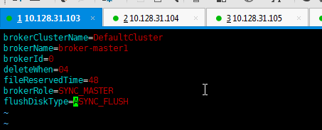

【同步复制方式下的主/备参数：SYNC_MASTER / SLAVE】

```
启动node103 broker进程：
nohup sh /home/MyRocketMQ-bin/bin/mqbroker -c /home/MyRocketMQ-bin/conf/2m-2s-sync/broker-master1.properties>bk.log
```

***

```
node104：
cp /home/MyRocketMQ-bin/conf/2m-2s-sync/broker-a.properties /home/MyRocketMQ-bin/conf/2m-2s-sync/broker-master2.properties
vim /home/MyRocketMQ-bin/conf/2m-2s-sync/broker-master2.properties
```

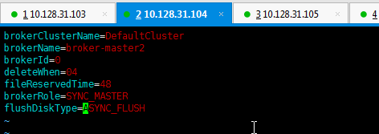

```
启动node104 broker进程：
nohup sh /home/MyRocketMQ-bin/bin/mqbroker -c /home/MyRocketMQ-bin/conf/2m-2s-sync/broker-master2.properties>bk.log
```

*******

```
node105：
cp /home/MyRocketMQ-bin/conf/2m-2s-sync/broker-a.properties /home/MyRocketMQ-bin/conf/2m-2s-sync/broker-slave1.properties
vim /home/MyRocketMQ-bin/conf/2m-2s-sync/broker-slave1.properties
```

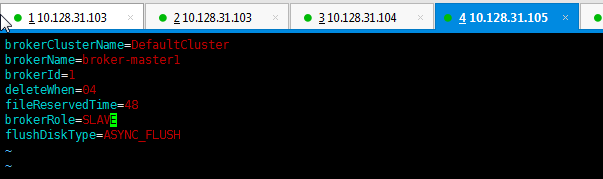

```
启动node105 broker进程：
sh /home/MyRocketMQ-bin/bin/mqbroker -c /home/MyRocketMQ-bin/conf/2m-2s-sync/broker-slave1.properties
```

***

```
node106：
cp /home/MyRocketMQ-bin/conf/2m-2s-sync/broker-a.properties /home/MyRocketMQ-bin/conf/2m-2s-sync/broker-slave2.properties
vim /home/MyRocketMQ-bin/conf/2m-2s-sync/broker-slave2.properties
```

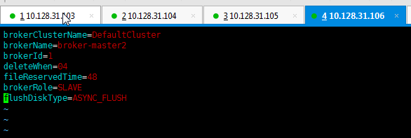

```
启动node106 broker进程：
sh /home/MyRocketMQ-bin/bin/mqbroker -c /home/MyRocketMQ-bin/conf/2m-2s-sync/broker-slave2.properties
```

__至此，NameServer/Broker集群服务都已启动__

***

###4、启动Producer

```
node107 启动生成者：
sh /home/MyRocketMQ-bin/bin/tools.sh com.alibaba.rocketmq.example.simple.Producer
```

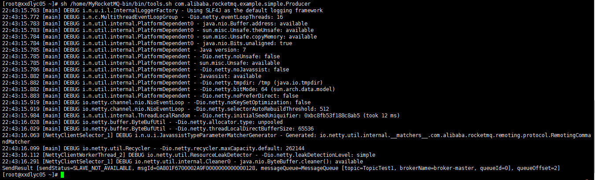

***

###5、启动Consumer

```
node108 启动消费者：
sh /home/MyRocketMQ-bin/bin/tools.sh  com.alibaba.rocketmq.example.simple.PushConsumer
```

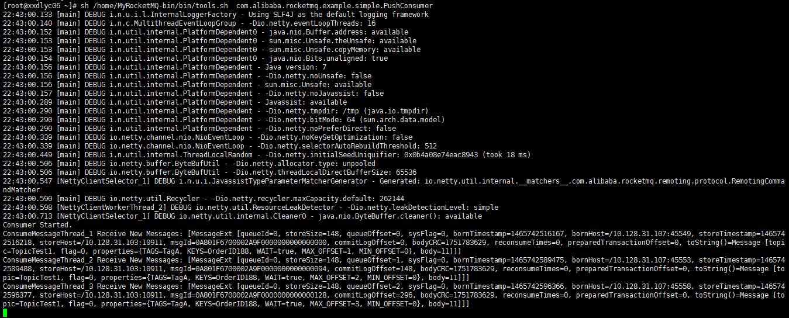


>PS：启动顺序总结：
1. 先启动nameser集群所有节点   
2. 启动Broker所有的master节点   
3. 启动Broker所有slave节点


##七、rocket-web控制台配置搭建：

### 1、下载tomcat至centos7：

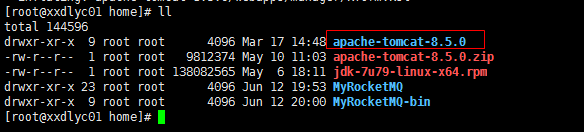

### 2、下载rocketmq-console项目，编译回去war包

（官方地址：[https://github.com/rocketmq/rocketmq-console](https://github.com/rocketmq/rocketmq-console)）：
【附个war包下载地址：http://download.csdn.net/detail/howie_zhw/9580058#comment】

编译之前需要修改config.properties文件nameser为当前环境nameser集群值：


### 3、将编译完成的war拷贝到tomcat对应的webapps目录下：

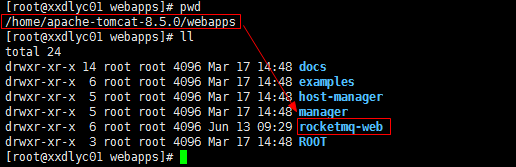

### 4、运行tomcat：

```
 sh /home/apache-tomcat-8.5.0/bin/catalina.sh run
```

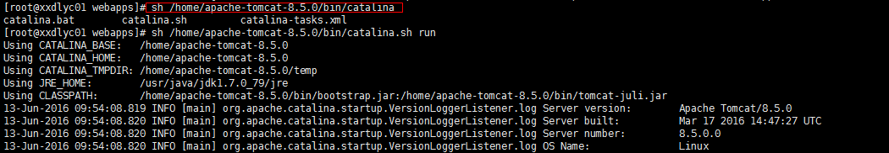

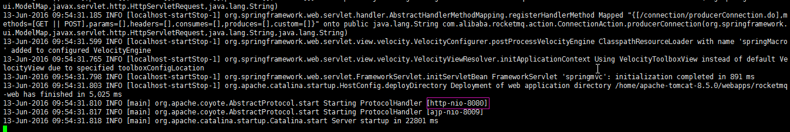

###5、页面访问web控制台：

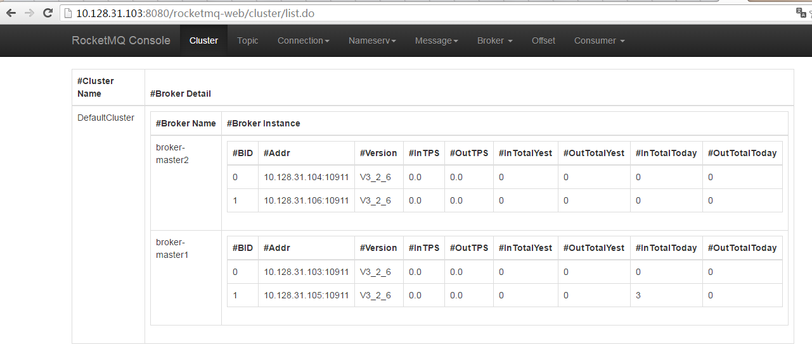

【不方便编译的话，直接下载war包copy到tomcat/webapps下，到自动生成的文件夹：rocketmq-console/WEB_INF/classes/config.properties 修改默认的127.0.0.1:9876 地址为你的nameserver地址，重启tomcat服务，访问http://tomcatIP地址:8080/rocketmq-console/cluster/list.do 就可以了】

##以下为附加内容，作为参考：

###附1、集群操作命令汇总及自定义简化命令：


####1、启动NameServer：
```
sh /home/MyRocketMQ-bin/bin/mqnamesrv
```
####2、启动Broker
```
如果将上述所有的配置文件name统一修改为：2m2s-sync-borker.properties
则可以使用一下命令启动各节点Broker：
sh /home/MyRocketMQ-bin/bin/mqbroker -c /home/MyRocketMQ-bin/conf/2m-2s-sync/2m2s-sync-borker.properties
```
####3、停止NameServer及Broker命令：
```
ps aux | grep NamesrvStartup | grep -v grep | awk '{print $2}' | xargs kill -9
ps aux | grep BrokerStartup | grep -v grep | awk '{print $2}' | xargs kill -9
```
####4、自定义Alias命令（首先建立文件目录：mkdir /var/log/rocketmq）：
```
alias stna='nohup sh /home/MyRocketMQ-bin/bin/mqnamesrv > /var/log/rocketmq/mqnamesrv.log &'
alias stbr='nohup sh /home/MyRocketMQ-bin/bin/mqbroker -c /home/MyRocketMQ-bin/conf/2m-2s-sync/2m2s-sync-borker.properties > /var/log/rocketmq/broker.log &'
alias killna="ps aux | grep NamesrvStartup | grep -v grep | awk '{print $2}' | xargs kill -9"
alias stpr='sh /home/MyRocketMQ-bin/bin/tools.sh com.alibaba.rocketmq.example.simple.Producer'
alias stco='sh /home/MyRocketMQ-bin/bin/tools.sh com.alibaba.rocketmq.example.simple.PushConsumer'
alias killbr="ps aux | grep BrokerStartup | grep -v grep | awk '{print $2}' | xargs kill -9"
```

####5、添加到.bashrc中：

```
vim /root/.bashrc
```

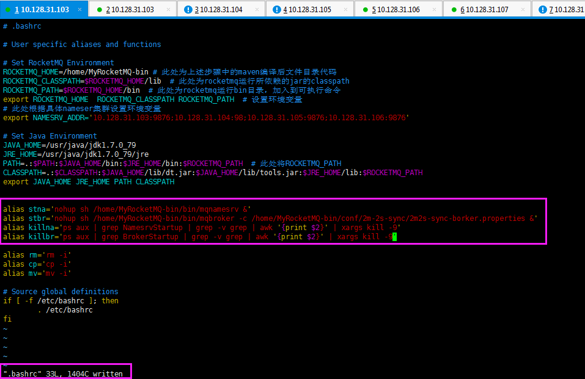

####6、使用简短命令操作：

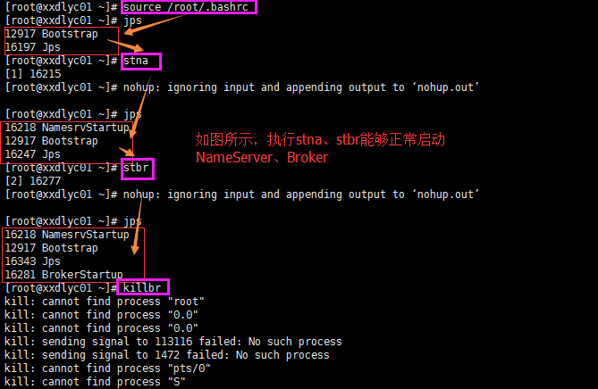


###附2：Broker相关配置参数：

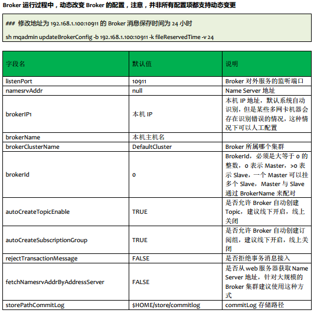

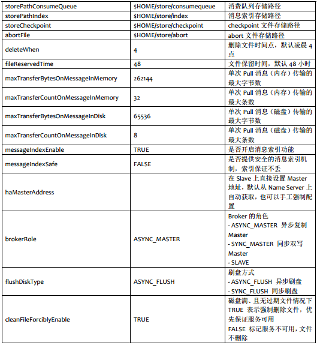

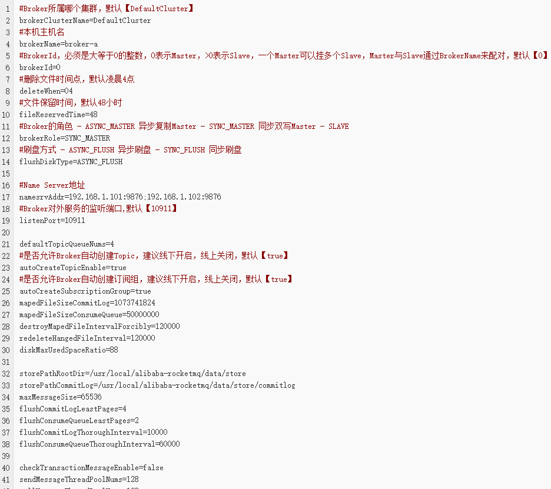

###附3：NameserStartup僵尸进程解决办法：


假若需要kill 掉进程，不能使用jps查看进程来kill 否则会出现僵尸进程：

如果出现僵尸进程则需要使用ps -ahp 21514来查找僵尸进程的父进程，接着再kill掉。

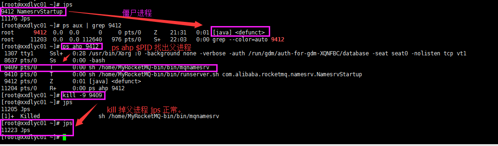

【RocketMQ提供了“温柔”关闭namesrv、broker服务的命令：mqshutdown】

###附4：获取当前broker全局配置：

```
mqbroker -m（ mqbroker -p打印全部）
```

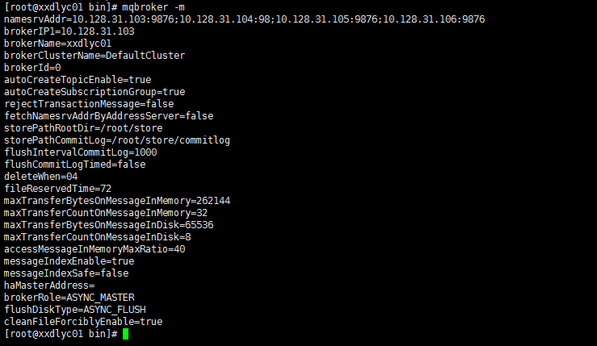

###附5：RocketMQ中Readme

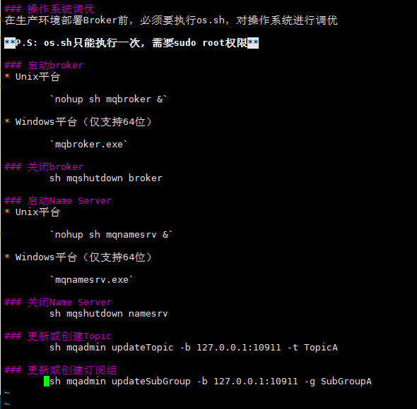

###附6：rocket-console控制台展示
【下图为笔者测试截图，具体信息与上文信息不符请见谅】

####查询指定topic的produceGroupName：

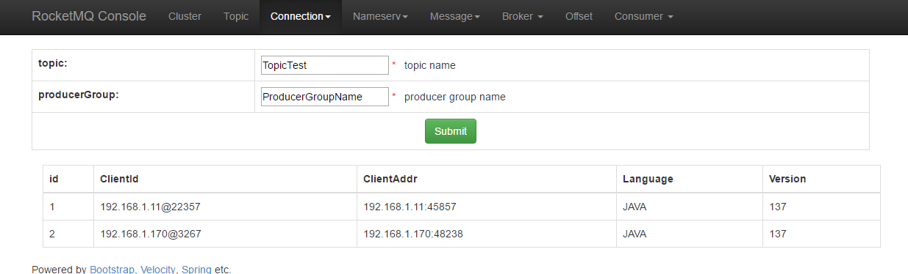

####查询Topic情况

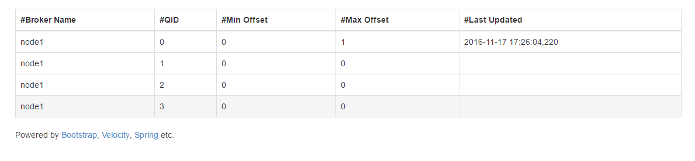


####查询消费者组

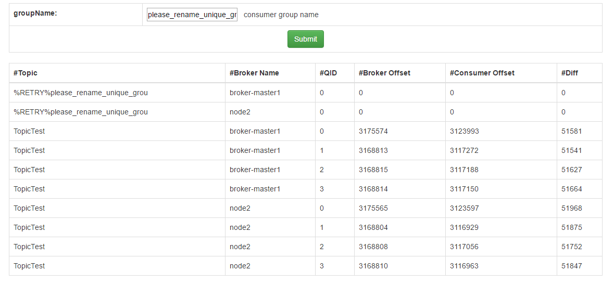


####查询某条消息信息

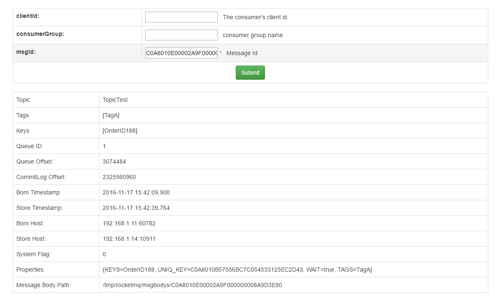


##FAQ

###1、启动Nameserver或broker服务提示内存不足

**现象描述**：
"_VM warning: INFO: OS::commit_memory(0x00000006c0000000, 2147483648, 0) faild; error='Cannot allocate memory' (errno=12)_"


**解决方案**：修改`/RocketMQ/devnev/bin/` 下的服务启动脚本  `runserver.sh` 、`runbroker.sh` 中对于内存的限制，​改成如下示例：

```
 JAVA_OPT="${JAVA_OPT} -server -Xms128m -Xmx128m -Xmn128m -XX:PermSize=128m -XX:MaxPermSize=128m"
```

###2、tomcat配置和启动问题

tomcat启动：进入安装目录

* bin/startup.sh #启动tomcat
* bin/shutdown.sh #停止tomcat

或者直接输入tomcat命令启动（笔者yum安装的tomcat7.04）
```
tomcat start(stop)
```
tomcat启动后，仍无法访问的问题可以参考几点：

* 端口监听未添加
* 端口被防火墙阻拦，关闭防火墙
* 如果是用yum安装的tomcat，能够正常启动，但是无法访问ip:8080。经笔者测试，是由于yum安装的tomcat缺少ROOT等文件，无法访问ip:8080成功，但是将rocket-console部署到webapps中，是可以正常访问到的。

###3、如何自定义Producer、Consume内容进行消息收发测试？
问题描述：如何自定义Producer、Consumer的代码运行，比如修改Producer的topic，发送条数，Consumer的Group name等信息

解读：目前Producer、Consumer的启动是通过tool.sh进行启动，其调用的是已经封装好的jar包，所以无法直接修改Producer的代码进行测试。

解决办法：可通过编写demo项目，导入RocketMQ的依赖包，运行测试程序Producer、Consumer进行测试，具体方案参看[Myeclipse中搭建RocketMQ测试项目](www.xxx.com)

